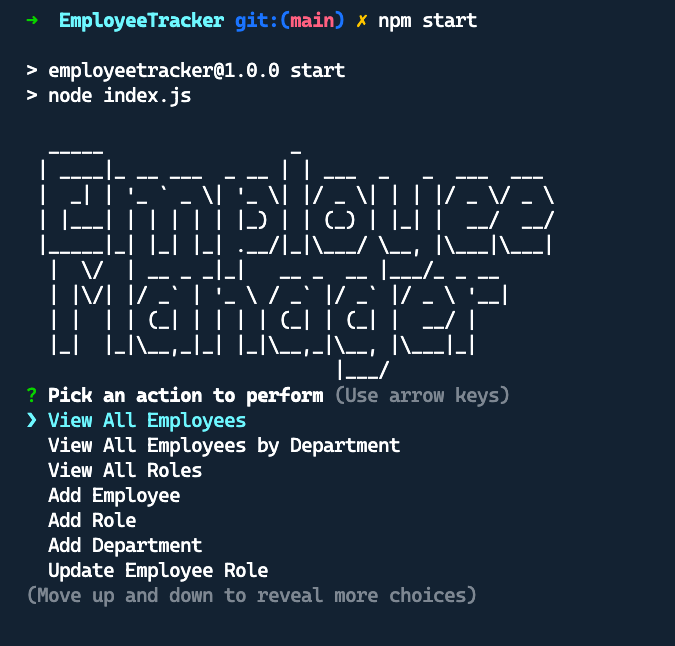

# MySQL Employee Tracker

## Description 
  
Architect and build a solution for managing a company's employees using node, inquirer, and MySQL.

## Table of Contents
* [Installation](#installation)
* [Usage](#usage)
* [License](#license)
* [Questions](#questions)
  
## Installation

*Steps required to install project and how to get the development environment running:*

1. Download or clone repository
2. Node.js is required to run the application
3. `npm install` to install the required npm packages

## Usage

* To start using the application, use mySQL Workbench to setup the database using this file

    [schema.sql](./db/schema.sql)

* The application is invoked by running `node index.js` or `npm start` in the command line

* Click on the screenshot below to watch a demo video:

## License

MIT License

---

## Questions

* Please submit any questions at my [GitHub profile](https://github.com/grider27)

* Also, you can reach me via email @ grider27@gmail.com